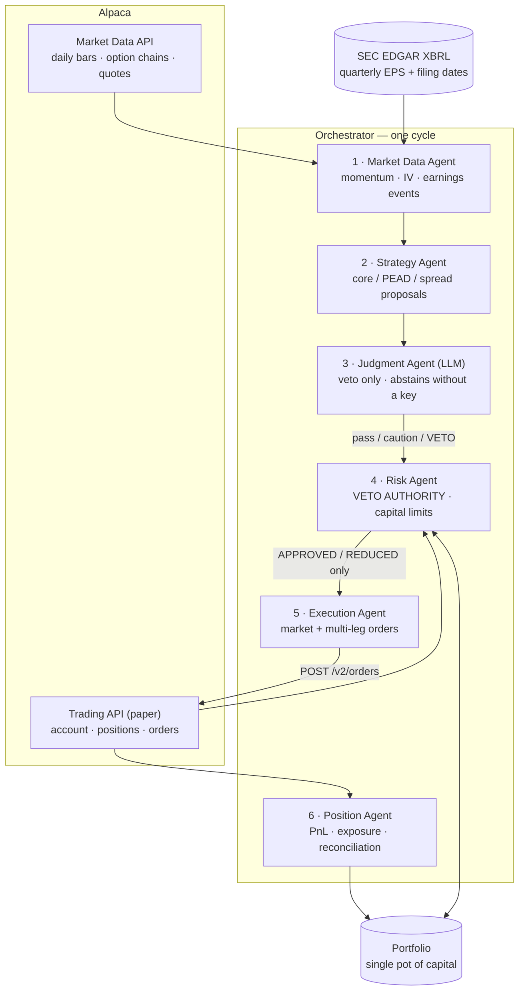

# Momentum + Options Agents

An agentic trading system for US equities and defined-risk options, built on
Alpaca's Trading API. Five agents pick names by momentum and post-earnings drift,
sell defined-risk put spreads against them, and enforce hard capital limits before
anything reaches the broker.

**Paper trading only.** Four independent gates must pass before a single order can
leave the process. There is no live-trading code path.

---

## The strategy

**Core sleeve — momentum.** Every rebalance, score every liquid name on
point-in-time momentum:

```
score = 0.45 × (12-1 month return / vol)   ← 12-month return, SKIPPING the last month
      + 0.25 × (3-month return    / vol)
      + 0.20 × trend                        ← 1.0 if px>SMA50>SMA200, 0.5 if px>SMA200
      + 0.10 × (relative strength / vol)    ← momentum minus SPY's
```

The last month is skipped because of short-term reversal; dividing by 60-day
realised volatility stops a lottery ticket outranking a compounder for being
noisy. Hold the top N equal-weight. If SPY is below its own 200-day SMA, hold
**cash** and skip the cycle.

**Alpha sleeve — PEAD.** Post-earnings announcement drift, on **real SEC data**.
`scripts/fetch_earnings.py` pulls quarterly diluted EPS and filing dates from
EDGAR's XBRL API. Surprise is measured two ways and both must agree: **SUE**
(seasonal random walk, Bernard & Thomas 1989) from the reported EPS, and a
volume-confirmed announcement gap. Entry is the day *after* the detected
announcement, so the strategy captures the drift and never the jump.

**Options overlay.** Short 20-delta put credit spreads on names the model already
holds — bullish exposure with *positive* theta instead of paying it. Max loss is
the spread width, always.

**[STRATEGY.md](STRATEGY.md) is the one-page summary — start there.**
Full evidence, every parameter and every failed experiment:
[docs/STRATEGY_DETAIL.md](docs/STRATEGY_DETAIL.md),
[docs/DIRECTIONAL.md](docs/DIRECTIONAL.md),
[docs/UNIVERSE.md](docs/UNIVERSE.md).

---

## Architecture



**The one-way valve:** the Execution Agent is the only component that can write to
Alpaca, and it **raises** rather than submits if handed an unapproved decision. The
Strategy Agent never sees a risk limit. The Judgment Agent can only veto — it can
never invent a trade, size one, or overrule risk.

---

## One pot of money

The single most important invariant, enforced in
[`portfolio.py`](src/options_agents/portfolio.py) by assertions that raise:

- `cash >= 0` — you cannot spend money you do not have.
- Every short spread reserves `(width − credit) × 100 × contracts` in cash, and
  **that cash cannot also buy stock**.
- Stock is bought only from unreserved cash.

This exists because an earlier version of the backtester allocated 100% of equity
to stock and *then* sold spreads collateralised by money already spent. That
silent leverage inflated the 15-year CAGR by roughly **8 percentage points** and
reversed a conclusion. `tests/test_portfolio.py` pins it.

---

## Setup

```bash
cp .env.example .env    # then fill in your PAPER key, secret, and account number
```

```bash
python -m pip install -r requirements.txt
```

Fetch the data (one-off; everything after this runs offline):

```bash
python scripts/fetch_broad_universe.py && python scripts/augment_failures.py && python scripts/fetch_earnings.py
```

### The four paper gates

No order is submitted unless **all four** pass:

1. `PAPER_TRADING=true` in the environment.
2. `ALPACA_BASE_URL` is Alpaca's paper endpoint.
3. The account number Alpaca returns starts with `PA`.
4. It matches `ALPACA_ACCOUNT_NUMBER` **and** its SHA-256 is in
   `ALLOWED_ACCOUNT_HASHES` in `broker.py`.

Gate 4 stores a **hash, not an account number**, so this repository is public
without disclosing which account it trades. `.env` can only narrow the allowlist;
widening it requires editing tracked source, which is a reviewable change.

Fail any gate and the process exits with code 2 and `REFUSED: …`.

---

## Commands

```bash
python -m options_agents.cli cycle
```
One full agent cycle as a **dry run** — prints intended orders, submits nothing.

```bash
python -m options_agents.cli cycle --execute
```
Same, but submits to Alpaca **paper**.

```bash
python -m options_agents.cli cycle --no-llm
```
Skip the Judgment Agent entirely (it also abstains on its own without an API key).

```bash
python -m options_agents.cli status
```

```bash
python scripts/run_live_config.py
```
Backtest **the deployed configuration** — all three sleeves sharing one pot of
capital. This is the one that matches what the agents run.

```bash
python scripts/report.py
```
Per-sleeve attribution tearsheet: return, win rate, per-trade Sharpe, profit
factor, drawdown, annualised Sharpe, beta, alpha, and the SPY benchmark.

```bash
python scripts/test_universe.py
```
The survivorship-bias check: strategy on a hand-picked universe versus a
mechanically screened one.

```bash
python -m pytest tests/ -q
```

---

## Logging

Every snapshot, proposal, judgment, risk decision, order request, order response
and position summary is appended to `logs/events-YYYY-MM-DD.jsonl`, one JSON
object per line, tagged with `agent`, `event`, a per-cycle `run_id`, and both UTC
and ET timestamps.

```bash
jq -c 'select(.agent=="risk") | .payload.decisions[]' logs/events-*.jsonl
```

---

## Honest limitations

Read these before believing any number in this repo.

1. **Survivorship bias is the dominant caveat.** The original 39-name universe was
   hand-picked with hindsight. On a 951-name mechanically screened universe the
   momentum alpha survives (+28.7%/yr vs +45.7%) but **~40% of it was universe
   selection**. See [docs/UNIVERSE.md](docs/UNIVERSE.md).
2. **The options overlay is not universally additive.** With correct capital
   accounting it helps in one of three periods on a fully-invested momentum book,
   because collateral competes with a high-returning core. It *is* additive on the
   cash-heavy PEAD sleeve, where collateral is free.
3. **Option prices in the backtest are modelled, not replayed.** No historical
   option chain is available, so Black-Scholes on a volatility surface built from
   VIX/VXN (index) or realised vol × 1.10 (single names). Frictions are charged
   both ways, but this is an edge estimate, not an achievable P&L.
4. **The overlay has not filled in paper yet.** Three spreads were submitted on
   2026-08-28 and all three expired unfilled; the causes were execution defects,
   fixed on 2026-09-03 and pinned by regression tests
   (`docs/STRATEGY_DETAIL.md` §3.4.1). Until spreads actually fill, every overlay
   number in this repo is a model output and the live system is a momentum book
   with a PEAD sleeve.
5. **The strategy is high-beta and high-drawdown.** −38% on the broad universe. It
   maximises return, not survivability.
6. **It underperforms in low-volatility melt-ups**, when the market runs away from
   a concentrated book and short premium is not paid.
7. **Screening to large, calm names collapses the alpha to ~+1%/yr.** The edge
   lives in volatility. This is not a quality strategy in disguise.
8. **Alpaca's IEX daily history starts ~2020-07**, so the broad-universe test
   covers one regime (~6 years), and IEX quotes are not the NBBO.

## Layout

```
src/options_agents/
  portfolio.py        single pot of capital; invariants that raise
  broker.py           the only module that talks to Alpaca; 4 paper gates
  pricing.py          Black-Scholes + greeks (clean room, stdlib only)
  volatility.py       vol surface: term structure + skew
  selection.py        point-in-time momentum scoring
  earnings.py         SEC XBRL events, SUE, announcement detection
  llm.py              Judgment Agent; abstains without a key
  agents/             the five agents, one file each
  orchestrator.py     wires one cycle
  backtest_*.py       directional and PEAD backtesters
  tearsheet.py        full metric suite incl. beta and alpha
scripts/              data fetchers and backtest runners
docs/                 evidence, including everything that failed
tests/                capital invariants, agent boundaries, pricing
```
